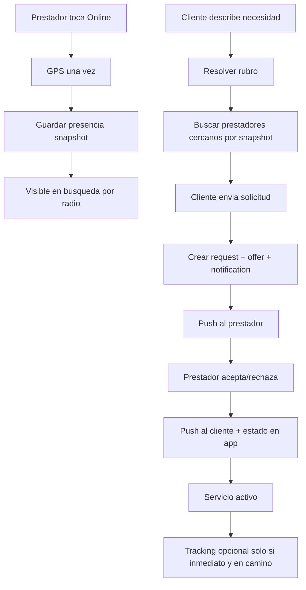

# MIMI Servicios - Fase 0 auditoria low-cost enterprise

Fecha: 2026-05-10
Alcance: auditoria sin cambios de codigo productivo.
Objetivo: convertir MIMI Servicios en producto principal, bajar costo operativo, reducir realtime/tracking innecesario y preparar una arquitectura escalable.

## Resumen ejecutivo

MIMI Servicios ya tiene una base tecnica fuerte: categorias reales, resolucion de rubros, solicitudes, ofertas, ciclo de vida completo, push FCM HTTP v1, auditoria backend, chat, realtime filtrado y service workers. El problema principal no es falta de backend, sino mezcla de arquitecturas: Servicios todavia combina push, realtime, polling fallback, tracking GPS y mapas vivos como si fuera Transporte.

La decision de negocio de poner Servicios como producto principal es correcta. Para servicios, el modelo escalable no debe ser Uber completo; debe ser marketplace low-cost:

- presencia online/offline;
- ubicacion snapshot al ponerse online;
- busqueda por radio usando ultima ubicacion;
- push como canal principal;
- realtime solo en solicitud/chat activos;
- tracking solo en servicio inmediato aceptado;
- polling liviano como fallback, no como motor principal.

No se modifico codigo en esta fase. La auditoria deja el plan seguro para Fase 1.

## Arquitectura actual detectada

### Frontend Servicios

- Cliente: `mimi-servicios/src/main-client.js`
- Prestador: `mimi-servicios/src/main-provider.js`
- API frontend: `mimi-servicios/src/services/service-api.js`
- Realtime: `mimi-servicios/src/services/realtime.js`
- Push: `mimi-servicios/src/services/push.js`
- UI cliente/prestador: `mimi-servicios/src/ui/render-client.js`, `mimi-servicios/src/ui/render-provider.js`
- Mapas: `mimi-servicios/src/services/map.js` + `js/mimi-maps/*`
- Service worker: `mimi-servicios/sw-2026.js`
- Manifests: `mimi-servicios/manifest.json`, `mimi-servicios/manifest-prestador.json`

### Backend Servicios

- Solicitud: `mimi-servicios/supabase/functions/svc-create-request/index.ts`
- Busqueda: `mimi-servicios/supabase/functions/svc-search-providers/index.ts`
- Respuesta prestador: `mimi-servicios/supabase/functions/svc-provider-respond-offer/index.ts`
- Estados: `svc-provider-en-route`, `svc-provider-arrived`, `svc-start-service`, `svc-complete-service`
- Tracking: `mimi-servicios/supabase/functions/svc-track-location/index.ts`
- Dispositivos push: `mimi-servicios/supabase/functions/svc-register-device/index.ts`
- Push compartido: `mimi-servicios/supabase/functions/_shared/push-notifications.ts`

### Transporte

Transporte sigue expuesto en:

- `/viaje` -> `index.html`
- `/chofer` -> `chofer-panel.html`
- home actual `/` -> `hub-clientes.html`, donde Transporte aparece antes que Servicios

No debe eliminarse. Debe quedar como modulo secundario/futuro.

## Que funciona

1. Backend enterprise validado anteriormente: RPC/RLS/security definer/audit/expiration OK.
2. Solicitud cliente -> oferta prestador existe.
3. `svc-create-request` guarda detalle de servicio, precio, unidad, cantidad, direccion y metadata.
4. `svc-create-request` crea `svc_notifications` y dispara push al prestador.
5. Prestador acepta/rechaza con `svc-provider-respond-offer`.
6. Ciclo de vida en ruta/llegue/iniciado/completado existe.
7. Push FCM HTTP v1 existe para Servicios.
8. `svc-register-device` guarda `svc_user_devices` y espejo en `push_tokens`.
9. `svc-search-providers` usa categorias reales, providers aprobados, estado online y ultima ubicacion.
10. Cliente exige domicilio confirmado antes de buscar.
11. E2E global existe, aunque en esta corrida queda bloqueado por entorno local.
12. Rutas/manifests/SW pasan auditoria local.

## Que esta roto o incompleto

1. Servicios todavia no es producto principal visual: home actual conserva narrativa Transporte.
2. No existe tabla dedicada `svc_provider_presence`; la presencia vive en `svc_providers`.
3. Al ponerse online, prestador actualiza ubicacion, pero tambien arranca tracking en `main-provider.js`.
4. Hay dos rutas de tracking prestador: `main-provider.js` y `controllers/provider-controller.js`.
5. `mimi-servicios/src/controllers/bootstrap-controller.js` importa funciones realtime que no existen en `services/realtime.js`; parece codigo legacy/no conectado, pero debe limpiarse o alinear exportaciones antes de usarlo.
6. `services/realtime.js` abre canales para notificaciones, mensajes, request, offer y tracking; es correcto para activo, pero excesivo como default permanente.
7. `main-client.js` subscribe realtime a notificaciones aunque push ya existe.
8. `bootstrap-controller.js` tiene fallback polling cada 15s. Para bajo costo debe volverse adaptativo o solo en pantalla activa.
9. `svc-track-location` inserta fila en `svc_tracking` y actualiza `svc_providers` cada envio; para servicios debe usarse solo en servicio activo.
10. `updateProviderStatus` actualiza `svc_providers`, no una tabla dedicada de presencia.
11. Push frontend tiene doble implementacion conceptual: `mimi-servicios/src/services/push.js` y `js/push-support.js`/`js/push-fcm.js` para otros contextos.
12. Las keys publicas Firebase/VAPID estan hardcodeadas en frontend; son publicas por naturaleza, pero conviene centralizar por config para mantenimiento.
13. Hay logs de debug abundantes en cliente/prestador que deben bajar para UX/produccion.
14. Algunos textos siguen con encoding mojado en codigo fuente, aunque `audit-encoding` no detecta archivos con findings.
15. Botones principales tienen loading en varias partes, pero no hay helper global compartido para todos los flujos.
16. No hay `safeSupabaseCall`/`preventDoubleSubmit` global reutilizable.
17. La UI aun mezcla lenguaje de tracking/mapa para Servicios donde conviene hablar de estado y coordinacion.
18. Transporte sigue teniendo tracking y realtime intensivo; debe mantenerse, pero fuera del foco principal.
19. No se pudo ejecutar E2E autenticado por variables faltantes en entorno local.
20. No se valido entrega push real en dispositivo durante esta fase; requiere usuario/token/permiso real.

## Top 20 problemas priorizados

| Prioridad | Problema | Evidencia | Riesgo |
|---|---|---|---|
| P0 | Servicios no es home principal real | `vercel.json` `/` -> `hub-clientes.html`; hub muestra Transporte primero | Producto comunica foco equivocado |
| P0 | Tracking inicia al ponerse online | `main-provider.js` `handleGoOnline()` llama `startLocationTracking()` | Costo y bateria innecesarios |
| P0 | Realtime por defecto en cliente/prestador | `services/realtime.js` + `main-client.js setupRealtime()` | Conexiones persistentes innecesarias |
| P0 | Presencia no esta separada | no existe `svc_provider_presence` | Dificulta escalar y auditar online/offline |
| P1 | Fallback polling fijo 15s en bootstrap legacy | `bootstrap-controller.js` `startRealtimeFallback()` | Costo si se activa masivamente |
| P1 | Doble ruta de tracking prestador | `main-provider.js` y `provider-controller.js` | Riesgo de duplicar GPS/escrituras |
| P1 | Codigo legacy con imports rotos | `bootstrap-controller.js` importa exports inexistentes | Riesgo si se conecta accidentalmente |
| P1 | Push existe pero no es eje unico del flujo | `svc-create-request` manda push, pero realtime sigue base | Costo de websocket innecesario |
| P1 | Botones/loading no estan estandarizados | helpers locales, no globales | UX inconsistente |
| P1 | Logs productivos abundantes | `console.log` en flujos solicitud/cancelacion | Ruido y posible filtrado operativo |
| P2 | Service worker Servicios usa cache amplio | `sw-2026.js` precachea muchos assets | Riesgo de assets viejos si no se versiona |
| P2 | Firebase config duplicada | `push.js`, `push-support.js`, `push-fcm.js`, SW | Mantenimiento dificil |
| P2 | Cliente escucha tracking activo | `subscribeRequest` incluye `svc_tracking` | Debe ser solo servicio inmediato aceptado |
| P2 | Provider escucha offer realtime | `subscribeProviderOffers` | Mantener solo si push no esta disponible o app abierta |
| P2 | Busqueda usa `svc_providers.last_lat/lng` | `svc-search-providers` | OK para compatibilidad, pero presencia deberia ser dedicada |
| P2 | Solicitud crea payment intent siempre | `svc-create-request` inserta `svc_payment_intents` incluso total 0 | Puede generar ruido financiero |
| P3 | Texto UX de mapas/tracking en Servicios | varias UI strings | Confunde modelo de marketplace |
| P3 | Transporte sigue prominente | hub y metadatos | No rompe, pero distrae |
| P3 | No hay test push real local | entorno no tiene credenciales E2E | Falta QA dispositivo |
| P3 | No hay load testing | no hay k6/artillery en repo | No permite prometer capacidad final |

## Top 20 oportunidades

1. Convertir `/` y hub cliente para priorizar Servicios.
2. Dejar Transporte como card secundaria "Modulo futuro/experimental".
3. Crear capa `svc_provider_presence` o vista/tabla compatible para presencia.
4. Al ponerse online: pedir GPS una vez, guardar snapshot, no tracking.
5. Heartbeat prestador cada 10/15 minutos, no cada segundos.
6. Mantener `svc_providers.status/last_lat/last_lng` como espejo para no romper busqueda actual.
7. Realtime cliente solo si hay `activeRequest` abierto en pantalla.
8. Realtime prestador solo si app abierta y esperando ofertas; push como canal principal.
9. Tracking solo para `PROVIDER_EN_ROUTE`, `PROVIDER_ARRIVED`, `IN_PROGRESS`.
10. Desactivar simulacion/route UI para servicios programados.
11. Crear helpers globales UX: `setButtonLoading`, `withTimeout`, `preventDoubleSubmit`, `safeSupabaseCall`.
12. Centralizar push config.
13. Mostrar "ultima ubicacion actualizada hace X" en prestador.
14. Mostrar "prestador online hace X min" en cliente.
15. Bajar logs a modo debug.
16. Agregar expiracion visual clara en solicitud.
17. Validar push con `svc_notification_deliveries`.
18. Hacer polling adaptativo solo cuando no hay push/realtime.
19. Crear QA especifico de presencia low-cost.
20. Medir eventos: solicitud creada, push enviada, push abierta, aceptada, finalizada.

## Arquitectura recomendada

### Modelo objetivo Servicios



### Presencia

Tabla propuesta para fase futura:

```sql
create table if not exists public.svc_provider_presence (
  provider_id uuid primary key references public.svc_providers(id) on delete cascade,
  is_online boolean not null default false,
  last_lat double precision,
  last_lng double precision,
  last_location geography(Point,4326),
  last_location_at timestamptz,
  last_seen_at timestamptz,
  service_radius_km numeric not null default 10,
  availability_status text not null default 'OFFLINE',
  accepts_remote boolean not null default false,
  current_request_id uuid references public.svc_requests(id),
  updated_at timestamptz not null default now()
);
```

Fase segura: primero mantener espejo en `svc_providers` para compatibilidad con `svc-search-providers`.

## Realtime: eliminar, mantener, cambiar

### Eliminar como default

- Tracking realtime para prestadores sin servicio activo.
- Realtime global de notificaciones si push esta concedido.
- Polling fijo cada 15s en contextos no visibles.
- Tracking al tocar Online.

### Mantener

- Realtime filtrado por `request_id` mientras cliente/prestador tiene solicitud activa abierta.
- Realtime de chat cuando el chat esta abierto.
- Realtime admin para trazabilidad/control.
- Realtime Transporte, pero como modulo secundario.

### Cambiar

- Provider offers: push primero; realtime solo cuando la app esta visible.
- Client notifications: push primero; realtime o polling bajo demanda al volver a la app.
- Tracking Servicios: solo desde estado `PROVIDER_EN_ROUTE` hasta `IN_PROGRESS`, con throttling.

## Roadmap tecnico por fases

### Fase 1 - Reestructuracion producto

- Cambiar home/hub para que Servicios sea protagonista.
- Mantener rutas Transporte sin borrar.
- Actualizar CTAs y metadatos publicos hacia Servicios.
- Riesgo: bajo si se limita a HTML/CSS/routing.

### Fase 2 - UX helpers enterprise

- Crear helpers compartidos: loading, timeout, doble submit, toast, inline status.
- Aplicar primero a busqueda, solicitar, online/offline, aceptar/rechazar/finalizar.
- Riesgo: medio; requiere QA manual mobile.

### Fase 3 - Low-cost runtime

- Online prestador = GPS one-shot + snapshot.
- Detener `startLocationTracking()` al ponerse online.
- Tracking solo al aceptar servicio inmediato.
- Riesgo: medio; requiere validar que busqueda siga encontrando prestadores.

### Fase 4 - Presencia dedicada

- Crear `svc_provider_presence` con RLS.
- Edge function o RPC para upsert presencia.
- Mantener espejo en `svc_providers` durante transicion.
- Riesgo: medio/alto; migration segura e idempotente.

### Fase 5 - Push first

- Pedir permiso en contexto correcto.
- Registrar token real.
- Confirmar `svc_notification_deliveries`.
- Fallback: in-app + polling adaptativo.
- Riesgo: depende de dispositivo/navegador.

### Fase 6 - QA/E2E

- E2E autenticado con envs.
- QA push real en Android/PWA.
- QA mobile 360/390/430.
- QA consola/network.

## QA ejecutado en Fase 0

| Comando | Resultado |
|---|---|
| `node qa/audit-encoding.js` | OK |
| `node qa/audit-supabase.js` | OK |
| `node --check mimi-servicios/src/services/service-api.js` | OK |
| `node --check mimi-servicios/src/main-client.js` | OK |
| `node --check mimi-servicios/src/main-provider.js` | OK |
| `node --check mimi-servicios/src/controllers/provider-controller.js` | OK |
| `node --check js/push-fcm.js` | OK |
| `node --check js/push-support.js` | OK |
| `node qa/audit-routes.js` | OK |
| `git diff --check` | OK |
| `node qa/enterprise-global-e2e.js` | BLOCKED_BY_ENVIRONMENT |

E2E bloqueado por variables faltantes:

- `MIMI_SUPABASE_URL`
- `MIMI_SUPABASE_ANON_KEY`
- `MIMI_E2E_CLIENT_EMAIL`
- `MIMI_E2E_CLIENT_PASSWORD`
- `MIMI_E2E_PROVIDER_EMAIL`
- `MIMI_E2E_PROVIDER_PASSWORD`
- `MIMI_E2E_ADMIN_EMAIL`
- `MIMI_E2E_ADMIN_PASSWORD`

## Estado final Fase 0

Fase 0 completada. No se toco codigo productivo. La aplicacion esta lista para avanzar a Fase 1 con cambios acotados y verificables.

Recomendacion: aplicar Fase 1 primero, porque es visible para negocio y de bajo riesgo: hacer que Servicios sea protagonista sin borrar Transporte.
