# Servicios Publication Hardening Release Train

## Reseña

Esta fase continúa el trabajo de persistencia y auditoría de servicios publicados en MIMIGO Servicios. El release train cubre edición de título/precio, desactivación, reactivación y cierre de escrituras directas legacy para que los cambios de servicios publicados pasen por `svc-save-provider-service` y queden auditados.

## Diagrama

```mermaid
flowchart LR
  A["Baseline producción<br/>dpl_F5ptkbhbiH6DNxL99cwKkvrkW5WS"] --> B["Edición auditada<br/>título/precio"]
  B --> C["Soft delete auditado<br/>deactivated"]
  C --> D["Reactivación auditada<br/>reactivated"]
  D --> E["Hardening escrituras directas<br/>offerings/pricing/categories"]
  E --> F["Migration cleanup completado<br/>historial Supabase"]
  F --> G["Migraciones aplicadas<br/>sólo esperadas"]
  G --> H["QA Paulo aprobada<br/>UI real"]
  H --> I["DB/audit Codex aprobado<br/>eventos y snapshots"]
  I --> J["Fase 2C aplicada<br/>hardening cerrado"]
  J --> K["Catálogo mínimo versionado"]
```

## Baseline oficial

- Producción vigente: `dpl_F5ptkbhbiH6DNxL99cwKkvrkW5WS`
- Base válida de trabajo: `C:\Users\paulo\OneDrive\Documentos\GitHub\mimi-transporte`
- No usar como base: `C:\Users\paulo\OneDrive\Documentos\GitHub\mimi-transporte-servicios-release`
- Motivo: `mimi-transporte-servicios-release` quedó desfasado y puede quitar wallet, notificaciones, login actual o flujo prestador completo.

## Fases aprobadas

- Edición título/precio auditada.
- Soft delete/desactivación auditada.
- Reactivación auditada.

## Fase 2C aplicada

Hardening de escrituras directas aplicado sobre:

- `svc_provider_service_offerings`
- `svc_provider_pricing`
- `svc_provider_categories`

Resultado: las escrituras directas legacy de `authenticated` quedaron cerradas para que todo cambio de servicios publicados pase por `svc-save-provider-service`, conservando lecturas necesarias y permisos de `service_role` para Edge Functions.

## Cambios incluidos en esta fase

- `20260520210959_svc_audit_reactivated_change_type.sql`
- `20260520220945_svc_provider_publication_write_hardening.sql`
- QA guardrails de UI y publicación.
- Verificación DB/audit posterior a pruebas manuales.

## Cambios excluidos

- Transporte.
- Mercado Pago.
- `payment-webhook`.
- Funciones de pago.
- `_shared/payments`.
- Pagos reales.
- Requests históricas.
- `svc_provider_profiles`.
- `svc_provider_availability`.
- Catálogo nuevo.
- IA.
- Pricing engine.
- Cotización interna.
- Ranking.

## Estado actual

- QA local pasó.
- Hardening aplicado.
- `20260520210959_svc_audit_reactivated_change_type.sql` fue clasificada como aplicada manualmente pero no registrada. El cambio ya existía remoto: el check constraint de `svc_provider_service_change_events.change_type` permitía `reactivated` y ya había eventos reales `source = svc-save-provider-service` con `change_type = reactivated`.
- `20260520210959_svc_audit_reactivated_change_type.sql` fue marcada como aplicada en historial mediante `supabase migration repair`.
- `20260520220945_svc_provider_publication_write_hardening.sql` fue aplicada mediante `supabase db push --linked`.
- Post-migración confirmado: `authenticated` ya no tiene `INSERT/UPDATE/DELETE` directo sobre `svc_provider_service_offerings`, `svc_provider_pricing` ni `svc_provider_categories`; `service_role` conserva permisos; sólo quedan policies `SELECT` en las tablas objetivo.
- `anon` no tiene escrituras directas.
- Dry-run final: `Remote database is up to date.`
- `svc-save-provider-service` es el camino válido de escritura.
- No hay pedido pendiente de repetir pruebas manuales ya aprobadas.

## Estado de aplicación

1. Migration history cleanup completado para `20260520210959_svc_audit_reactivated_change_type.sql`.
2. `20260520220945_svc_provider_publication_write_hardening.sql` aplicada.
3. Escritura directa `authenticated` bloqueada por grants/policies.
4. `service_role` conserva escritura para Edge Functions.
5. Rollback SQL disponible en la migración de hardening.

## Pruebas manuales Paulo aprobadas

Paulo ya validó en UI real. No pedir repetir estas pruebas salvo que se implemente un cambio nuevo relacionado:

- Editar título/precio.
- Crear o guardar servicio.
- Desactivar servicio.
- Reactivar servicio.
- Confirmar cliente/search.

## Verificaciones Codex aprobadas

Codex verificó sin pedir login/JWT:

- Audit event por cada cambio.
- `previous_snapshot`, `new_snapshot` y `diff` correctos.
- Cliente/search consistente con `active=true`.
- Verificación por grants/policies de que escritura directa `authenticated` queda bloqueada sobre:
  - `svc_provider_service_offerings`
  - `svc_provider_pricing`
  - `svc_provider_categories`

## Decisión de cierre

Estado registrado:

> Fase 2C hardening escrituras directas aprobada y aplicada.

## Guardrail de baseline productiva

Todo cambio futuro debe partir de `C:\Users\paulo\OneDrive\Documentos\GitHub\mimi-transporte`, no de `C:\Users\paulo\OneDrive\Documentos\GitHub\mimi-transporte-servicios-release`.

Antes de cualquier cambio o deploy se deben verificar markers de:

- Wallet.
- Notificaciones.
- Login actual.
- `provider-auth` / Google login.
- Locks `mimi_services_provider_auth`.
- Flujo prestador completo.
- `svc-save-provider-service`.
- `MIMI_REMOTE_BOOTSTRAP_ENABLED`.

Si falta cualquiera de estos markers, detenerse. No desplegar ni continuar desde esa base.

## Este documento NO autoriza rediseño ni reemplazo de UI

Este documento no autoriza transformar la app ni reemplazar la UI real vigente.

- No transformar la app.
- No reemplazar la UI real vigente.
- No quitar wallet.
- No quitar notificaciones.
- No modificar login.
- No tocar Transporte.
- No tocar pagos.
- No tocar `payment-webhook`.
- No implementar catálogo, IA o pricing engine desde una base desfasada.

## Próxima fase permitida

Próxima fase: Catálogo mínimo versionado.

Esa fase debe ser primero diseño y migraciones controladas. Debe estar detrás de feature flag o integración incremental. No debe reemplazar el flujo actual de prestador, no debe romper offerings/pricing/search actuales, no debe tocar pagos, no debe tocar Transporte y no debe tocar wallet/notificaciones/login.

No arrancar IA, pricing engine, cotización interna ni ranking hasta cerrar el catálogo mínimo versionado.

## Fase 3A Service Intelligence Foundation aplicada

La foundation de Service Intelligence quedo aplicada como fase aditiva posterior al hardening:

- `20260520230844_service_intelligence_foundation_schema.sql` aplicada y registrada.
- `20260520230852_service_intelligence_initial_seed.sql` aplicada y registrada.
- Dry-run posterior: `Remote database is up to date.`
- Feature flags de catalogo, one-shot search, preguntas dinamicas, pricing engine, quotes, discovery, regulated guard e IA quedaron en `false`.
- No hubo deploy Vercel.
- No hubo deploy Edge Functions.
- No hubo cambio de UI prestador/cliente.
- No se tocaron wallet, notificaciones, login, Transporte, pagos, payment-webhook ni requests historicas.

La siguiente fase operativa debe partir de esta foundation aplicada y seguir siendo incremental: admin catalogo / catalogo minimo versionado bajo feature flag, sin reemplazar la UI vigente.

## Regla de Release Train

- Si un cambio pertenece al Release Train, se despliega como parte del paquete controlado.
- Si un cambio no pertenece al Release Train, se separa.
- Ningún documento viejo puede ser usado como source of truth si contradice producción real.
- Producción real y `mimi-transporte` son la referencia operativa para continuidad.

## Guardrails permanentes

- Partir siempre de `mimi-transporte`, la UI real vigente.
- No usar `mimi-transporte-servicios-release`.
- No modificar wallet, notificaciones, login actual ni flujo prestador completo como efecto lateral.
- No tocar Transporte, Mercado Pago, payment-webhook, pagos ni requests históricas dentro de este release train.
- No aplicar migraciones ni desplegar sin gates verdes.
