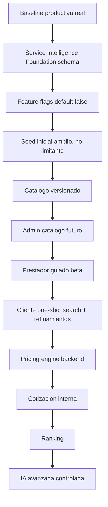

# Service Intelligence Foundation

## Estado

Fase 3A aplicada para MIMIGO Servicios. Esta foundation es aditiva y quedo
apagada por feature flags. No reemplaza la UI vigente, no cambia el flujo
actual de prestador, no cambia cliente/search actual y no activa IA, pricing
engine ni cotizacion publica.

Aplicacion confirmada:

- `20260520230844_service_intelligence_foundation_schema.sql` aplicada y registrada.
- `20260520230852_service_intelligence_initial_seed.sql` aplicada y registrada.
- Dry-run posterior: `Remote database is up to date.`
- Feature flags obligatorios existentes y en `false`.
- Tablas nuevas creadas con RLS activo.
- Seed inicial cargado como punto de partida no limitante.

Baseline obligatoria:

- Produccion vigente: `dpl_F5ptkbhbiH6DNxL99cwKkvrkW5WS`.
- Base valida: `C:\Users\paulo\OneDrive\Documentos\GitHub\mimi-transporte`.
- Base prohibida: `C:\Users\paulo\OneDrive\Documentos\GitHub\mimi-transporte-servicios-release`.

Antes de cualquier cambio o deploy se deben verificar estos markers:

- Wallet, `providerPayoutAccount`, `walletLoading`.
- Notificaciones, `notificationBadge`, `notificationsDrawer`, `sheetNotificationBell`.
- Login actual, `provider-auth`, Google login.
- Locks `mimi_services_provider_auth`.
- Flujo prestador completo.
- `svc-save-provider-service`.
- `MIMI_REMOTE_BOOTSTRAP_ENABLED`.

Si falta cualquiera, se detiene la fase.

## Vision

MIMIGO Servicios no debe ser una app limitada a un conjunto chico de rubros.
Debe ser un marketplace de servicios vivos donde el cliente escribe una
necesidad en lenguaje natural y el sistema encuentra rapidamente el tipo de
profesional correcto.

Los rubros y servicios seed son semillas iniciales. No son el limite del
sistema. La arquitectura permite nuevos rubros, nuevos servicios y nuevos tipos
de prestadores sin reescribir los flujos actuales.

## Regla UX Cliente

SEARCH-FIRST, QUESTIONS-LATER.

El cliente no debe completar un cuestionario largo antes de ver resultados.

Flujo objetivo:

1. El cliente escribe un solo mensaje.
2. MIMIGO interpreta intencion.
3. MIMIGO muestra resultados/prestadores lo antes posible.
4. Si faltan datos, muestra precio "desde", "estimado" o "cotizar".
5. Las preguntas aparecen como refinamiento opcional, no como bloqueo inicial.

Ejemplo:

Cliente: "Necesito pintar mi casa".

MIMIGO muestra pintores compatibles, servicios probables como pintura interior,
pintura exterior y cotizacion de obra, y chips opcionales como Interior,
Exterior, Humedad, Casa completa o Habitacion. No bloquea la primera busqueda
preguntando m2, habitaciones, humedad o quien compra materiales.

## Estrategia de Preguntas

Los templates y versiones soportan estos niveles:

- `NO_QUESTION`: hay intencion suficiente para mostrar resultados.
- `OPTIONAL_REFINEMENT`: mostrar resultados y chips/preguntas opcionales.
- `REQUIRED_BEFORE_PRICE`: mostrar prestadores igual, pero precio como desde o cotizar.
- `REQUIRED_BEFORE_RESULTS`: solo para casos muy ambiguos o riesgosos.
- `SAFETY_GATE`: salud, gas, electricidad riesgosa, menores, cuidado de personas o emergencias.

## Modelo de Datos

La foundation agrega tablas nuevas y columnas opcionales. No modifica requests
historicas ni cambia las tablas actuales de busqueda.

Tablas nuevas:

- `svc_feature_flags`: flags runtime, todos default false.
- `svc_service_templates`: servicio madre versionable.
- `svc_service_template_versions`: definicion publicada/draft/deprecated.
- `svc_service_attributes`: variables del servicio.
- `svc_service_questions`: preguntas dinamicas y refinamientos.
- `svc_pricing_rules`: reglas backend de precio o quote gate.
- `svc_provider_offering_attribute_values`: valores por offering del prestador.
- `svc_provider_offering_addons`: adicionales configurables.
- `svc_quote_requests`: base futura de cotizacion interna.
- `svc_quote_offers`: ofertas internas del prestador.
- `svc_quote_events`: auditoria de cotizacion.
- `svc_intent_resolution_events`: auditoria de clasificacion de intencion.
- `svc_pricing_decision_events`: auditoria de decisiones de precio.
- `svc_service_discovery_events`: rubros/servicios nuevos.
- `svc_regulated_service_requirements`: requisitos de servicios sensibles.

Relaciones opcionales:

- `svc_service_templates.category_id` referencia `svc_categories.id`.
- `svc_provider_service_offerings.service_template_id` es nullable.
- `svc_provider_service_offerings.service_template_version_id` es nullable.

La relacion con offerings queda preparada, pero no reemplaza el guardado actual.
Los cambios criticos de servicios publicados siguen pasando por
`svc-save-provider-service` y auditoria.

## Feature Flags

Todos los flags nacen apagados:

- `MIMI_SERVICE_CATALOG_V2_ENABLED=false`
- `MIMI_PROVIDER_GUIDED_SERVICE_ENABLED=false`
- `MIMI_CLIENT_DYNAMIC_QUESTIONS_ENABLED=false`
- `MIMI_PRICING_ENGINE_ENABLED=false`
- `MIMI_QUOTES_V2_ENABLED=false`
- `MIMI_AI_INTENT_ASSIST_ENABLED=false`
- `MIMI_SERVICE_DISCOVERY_ENABLED=false`
- `MIMI_REGULATED_SERVICES_GUARD_ENABLED=false`
- `MIMI_CLIENT_ONE_SHOT_SEARCH_ENABLED=false`

Impacto visual esperado en esta fase: ninguno.

## Seed Inicial

El seed inicial cubre macro verticales amplias:

- Hogar y mantenimiento.
- Construccion y refacciones.
- Salud y bienestar.
- Belleza y cuidado personal.
- Mascotas.
- Educacion.
- Tecnologia.
- Eventos.
- Cuidado de personas.
- Profesionales.
- Automotor liviano.
- Otros / discovery.

Incluye templates iniciales para pintura, plomeria, electricidad, gas, aire
acondicionado, cerrajeria, limpieza, jardineria, peluqueria, barberia,
maquillaje, manicura, depilacion, masajes, psicologia, kinesiologia, mascotas,
educacion, tecnologia, cuidado de personas, eventos y profesionales.

Este seed no limita el sistema. Nuevos rubros entran por catalogo admin o por
discovery events cuando la feature flag correspondiente se habilite.

## Servicios Sensibles o Regulados

La foundation incluye una capa para servicios sensibles o regulados. Ejemplos:

- Psicologia.
- Kinesiologia.
- Cuidado de adultos.
- Ninera o servicios con menores.
- Gas.
- Electricidad matriculada.
- Servicios de salud/bienestar.
- Profesionales con matricula.

Estos templates pueden requerir credenciales, matricula, jurisdiccion,
aprobacion admin, disclaimer de emergencia, bloqueo de autopricing y
cotizacion/manual review.

MIMIGO no diagnostica salud. Si el cliente dice "me duele el cuerpo", el
sistema puede orientar a masajista, kinesiologia, consulta medica o emergencia
segun senales de riesgo, pero no diagnostica ni inventa una indicacion medica.

## IA Futura

La IA se disena como asistencia, no como autoridad final.

Puede:

- Clasificar intencion del cliente.
- Detectar rubro/servicio probable.
- Extraer variables del mensaje.
- Sugerir resultados inmediatos.
- Sugerir chips o preguntas opcionales.
- Detectar servicios nuevos.
- Detectar servicios sensibles o regulados.
- Sugerir `quote_required`.
- Registrar decision/auditoria.

La IA no calcula ni inventa precios finales. No diagnostica salud. No aprueba
profesionales regulados. No salta backend, auditoria, pagos ni comision.

## Precios

El backend calcula o valida. La IA solo puede sugerir categoria, template,
variables, preguntas, confidence o `quote_required`.

El precio final sale de reglas backend, offering del prestador, variables,
add-ons, comision y snapshots. Si faltan datos, el cliente puede ver desde,
estimado o cotizar sin bloquear resultados salvo caso sensible o de riesgo.

## RLS y Seguridad

Todas las tablas nuevas nacen con RLS.

Reglas base:

- `service_role` conserva escritura total para Edge Functions/backend.
- `anon` y `authenticated` pueden leer catalogo activo segun policies.
- Escrituras de catalogo quedan limitadas a admin o service_role.
- Valores de offering y add-ons no se activan al publico y deben ser escritos
  por backend/Edge Function cuando se habiliten.
- Discovery insert desde `authenticated` queda detras de
  `MIMI_SERVICE_DISCOVERY_ENABLED=false` para evitar spam hasta tener control.
- Pricing decision events y quote events quedan restringidos.

## Que Se Vera En La App

En esta fase no se ve nada nuevo por defecto.

Cuando se habiliten flags en fases futuras, podran aparecer de forma
incremental:

- "Agregar servicio guiado (Beta)".
- "Servicios del catalogo".
- "Ajustar busqueda".
- Chips opcionales de refinamiento.
- Precio desde, estimado o cotizar.

Nada de esto debe reemplazar el flujo actual sin gate de release.

## Que NO Cambia

Esta foundation no autoriza:

- Reemplazar la UI real vigente.
- Quitar wallet.
- Quitar notificaciones.
- Cambiar login o Google login.
- Tocar Transporte.
- Tocar Mercado Pago.
- Tocar payment-webhook.
- Tocar pagos reales.
- Modificar requests historicas.
- Cambiar cliente/search actual.
- Reabrir escrituras directas legacy sobre servicios publicados.
- Activar pricing engine, IA o cotizacion publica.

## Diagrama

## Roadmap

- 3A Foundation: schema, seed, RLS, flags, docs y QA.
- 3B Admin catalogo: CRUD controlado, aprobacion y versionado.
- 3C Prestador guiado beta: agregar servicio desde catalogo sin reemplazar flujo actual.
- 3D Cliente one-shot search + refinamientos: search-first, questions-later.
- 3E Pricing engine: backend calcula/valida.
- 3F Cotizacion interna: quote requests y quote offers dentro de MIMIGO.
- 3G Ranking: matching/ranking auditado.
- 3H IA avanzada: clasificacion, extraccion y auditoria con limites.

## Fase 3B - Admin Catálogo Inteligente

Se agrego una seccion admin-only llamada `Catalogo Inteligente` para visualizar
la foundation aplicada sin activar superficies publicas. Esta fase no activa público.

Incluye vistas read-only de:

- Service templates.
- Versiones activas.
- Atributos.
- Preguntas dinamicas.
- Pricing rules.
- Requisitos de servicios sensibles o regulados.
- Discovery events.
- Feature flags de Service Intelligence.

La seccion permite buscar y filtrar por vertical, familia, riesgo regulado /
sensible, estado activo/inactivo y abrir un detalle del template. El detalle
muestra datos generales, version activa, atributos, preguntas, reglas, requisitos
regulados y metadata.

Modo de seguridad:

- Es admin-only.
- Usa la sesion admin existente y RLS/policies.
- No usa `service_role` en frontend.
- No escribe datos.
- No activa flags.
- No activa catalogo V2 publico.
- No activa preguntas dinamicas en cliente.
- No activa pricing engine, quotes ni IA.
- No cambia cliente/search actual.
- No cambia el flujo prestador actual.
- No toca wallet, notificaciones ni login.

Proximos pasos despues de esta fase:

- Edicion controlada de catalogo desde admin, con auditoria.
- Prestador guiado beta detras de feature flag.
- Cliente one-shot search + refinamientos detras de feature flag.

## Fase 3C - Prestador Guiado Beta

Se preparo una entrada beta para ayudar al prestador a cargar servicios desde
el catalogo versionado sin reemplazar la pantalla principal `Tus servicios`.

Reglas de producto:

- La pantalla principal del prestador sigue siendo `Tus servicios`.
- El flujo visible actual de agregar/editar servicios no cambia si
  `MIMI_PROVIDER_GUIDED_SERVICE_ENABLED=false`.
- La entrada `Agregar servicio guiado (Beta)` solo aparece con la flag activa.
- La guia permite buscar template/rubro, precargar nombre, categoria,
  pricing model, cotizacion y preguntas sugeridas.
- Las preguntas son ayuda contextual, no un formulario largo obligatorio.
- Los servicios sensibles/regulados muestran senales de cotizacion, credenciales
  o revision cuando el template lo exige.

Reglas tecnicas:

- El frontend lee catalogo de forma read-only desde tablas Service Intelligence.
- No usa `service_role` en frontend.
- No escribe catalogo desde prestador.
- El guardado de servicios publicados sigue pasando por
  `svc-save-provider-service`.
- No se reabre escritura directa legacy sobre offerings/pricing/categories.
- No cambia cliente/search actual.
- No activa pricing engine, quotes ni IA publica.

La activacion publica requiere deploy controlado, smoke de prestador y
verificacion DB/audit posterior al guardado.

## Gate De Aplicacion Ejecutado

Gate ejecutado antes de aplicar migraciones:

1. Baseline real `mimi-transporte` confirmada.
2. Guardrails wallet/notificaciones/login confirmados.
3. QA local ejecutado.
4. Dry-run Supabase limpio.
5. Se verifico que solo aparecian migraciones esperadas.
6. No se desplego UI ni Edge Functions en esta fase.
7. No se activaron flags.

Decision registrada:

`Fase 3A Service Intelligence Foundation aplicada.`
